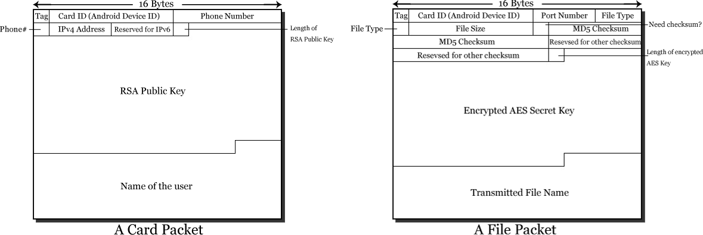

WIT
===

[Click here](Wit_slides.pptx) to see the English presentation slides for the Android version.

WIT is a wireless transfer that enables you to share your files, apps, contacts, photos, audio files with anyone in the same subnet.

You can even share thing without a gateway device if you turn on the Hotspot mode.

1. WIT for Android (Developed by Yuqing Guan, Qiaochu Li, Zheng Lan)
  - It includes a two-level encryption. The transmitted files will be encrypted by AES keys. The keys will be encrypted by RSA public keys.
  - We also provide a function to verify the files by MD5 checksum.
  - This app contains lists for all apps, contacts, photos, music and files in your phone. You can also record every user who was connected to you and import it to a new contact.
- WIT for iOS (Developed by Yuqing Guan, Zhenyu Zhou, Shubin Xu)
  - We encapsulated the raw BSD sockets and modified the problematic code of AsyncSocket to support network communication on iPhones.
  - The protocol of WIT for iOS is simplified so it cannot connect to WIT for Android directly.

Protocol Description:

